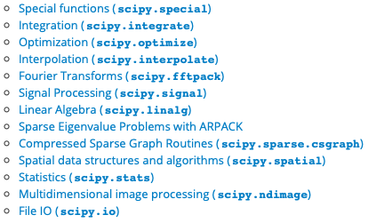

---
jupyter:
  jupytext:
    text_representation:
      extension: .md
      format_name: markdown
      format_version: '1.0'
      jupytext_version: 0.8.6
  kernelspec:
    display_name: Python 3
    language: python
    name: python3
---

# Cómputo científico

Python es un lenguaje muy cómodo para hacer scripts interactivos pequeños y también suficientemente robusto para hacer aplicaciones enteras. Lo que segúia era darle la capacidad de cómputo científico.

## Vectorización
Si han usado R o MATLAB, pueden esperar que el comando `2*[1, 2, 3]` regrese `[2, 4, 6]`. Sin embargo, una prueba rápida muestra otra cosa.

```python
2*[1, 2, 3]
```

Una manera de solucionarlo sería

```python
[2*x for x in [1, 2, 3]]
```

pero definitivamente es menos limpia. Lo que sucede en MATLAB y en R se llama **vectorización**, y formaliza (en lenguajes de programación) la idea de aplicar la misma operación a todos los elementos de un arreglo. Vectorizar operaciones reduce drásticamente los tiempos de ejecución. Sin embargo, para vectorizar se necesita un arreglo como el de R o MATLAB, que no pueda mezclar tipos pero sea muy rápido.

Para lograrlo, existe todo un ecosistema de cómputo científico en Python, patrocinado por [NumFOCUS](http://numfocus.org) bajo el lema **Open Code = Better Science**.


## NumPy

NumPy es la librería de arreglos de Python. Sobre ella está construido casi el resto del ecosistema, por lo que vale la pena detenerse a estudiarla. La convención es importar numpy así

```python
import numpy as np
```

Y ahora basta envolver nuestras listas en un arreglo de numpy.

```python
x = np.array([i for i in range(10)])
x
```

### Arreglos


Para este caso particular hay un comando más fácil, pero vean cómo pudimos enviar una lista como las que habíamos trabajado sin mayor dificultad.

```python
np.arange(10)
```

Los arreglos de NumPy no se limitan a una dimensión. Para hacer matrices, por ejemplo

```python
A = np.array([
    [1, 2, 3],
    [4, 5, 6]
])
A
```

O [arreglos en dimensiones mayores](https://en.wikipedia.org/wiki/Tensor)

```python
np.array([A, A])
```

Un arreglo de numpy tiene mucha funcionalidad incluida (recuerden que pueden usar `dir` para ver todos los métodos y atributos de un objeto) pero vamos a ver sólo la más común.

```python
x = np.array([1, 5, 7, 8, 9, 0])
```

```python
x.mean()
```

```python
x.std()
```

```python
x.dot(x)
```

```python
x.min()
```

```python
x.max()
```

```python
x.argmin()
```

```python
x.argmax()
```

```python
x.cumsum()
```

```python
x.sum()
```

```python
x.sort()
x
```

> Noten que este método modificó el arreglo.

```python
A.T
```

```python
A.trace()
```

```python
A.diagonal()
```

```python
y = np.array([1, 0, 1])
A.dot(y)
```

Para vectorizar funciones en NumPy, basta usar las funciones en el paquete en vez de las de `math`. Por ejemplo

```python
np.exp(x)
```

Es el arreglo equivalente a la lista

```python
from math import exp
[exp(i) for i in x]
```

pero con vectorización. 

Los arreglos no tienen que ser necesariamente numéricos. Por ejemplo,

```python
y = x > 0
y
```

es el arreglo `[lambda i: i>0 for i in x]`. Con arreglos de booleans, hay otras funciones interesantes

```python
y.any()
```

```python
y.all()
```

```python
~ y
```

```python
y.sum()
```

```python
y.mean()
```

> ¿Qué creen que hagan estas dos últimas?

Por supuesto que las funciones que ustedes definan usando las de numpy.


Una más, traida de MATLAB

```python
np.linspace(0, 100, 9)
```

```python
np.arange(0, 101, 12.5)
```

> ¿A qué les suena esta inconsistencia notacional tan horrible?


## SciPy


Aunque NumPy tiene suficiente para operar, la librería científica por excelencia es [SciPy](https://docs.scipy.org/doc/scipy/reference/). Comparten funciones sobre todo de álgebra lineal, pero SciPy compila sobre FORTRAN y NumPy no. (En general es mejor usar `scipy.linalg` que `numpy.linalg` a menos que sea scripting rápido.

SciPy tiene módulos casi para todo:



pero nos vamos a concentrar en álgebra lineal y un poquito de cálculo. 

### Álgebra Lineal: [`linalg`](https://docs.scipy.org/doc/scipy/reference/tutorial/linalg.html)

```python
from scipy import linalg
```

Ojo, SciPy es tan grande que es mejor importar sólo lo que van a usar. Ahora algo de álgebra lineal en SciPy:

```python
A = np.array([[1, 2, 3], [4, 6, 5], [9, 8, 7]])
```

#### Sistemas de ecuaciones

```python
linalg.inv(A)
```

```python
b = np.array([5, 7, 8])
```

```python
linalg.solve(A, b)
```

Para la solución de mínimos cuadrados lineales, sugiero `linalg.pinv2`, que calcula la [pseudoinversa de Moore-Penrose](https://en.wikipedia.org/wiki/Moore–Penrose_inverse) vía [SVD](https://en.wikipedia.org/wiki/Singular_value_decomposition).


#### Normas


`linalg.norm` permite calcular normas vectoriales y matriciales. Para ver la documentación, 

```python
?linalg.norm
```

En resumen, `linalg.norm` es la norma $p$ en vectores si `ord` < $\infty$

$$
\|\mathbf{x}\|_p = \left( \sum_{i=1}^n x_i^p\right)^\frac{1}{p}
$$

O bien, $\|\mathbf{x}\|_\infty = \max_i x_i$, enviando `ord=np.inf` o $\|\mathbf{x}\|_{-\infty} = \min_ix_i$.


Para normas matriciales 

$$
\|A\| = 
\begin{cases}
    \max_i\sum_j|a_{ij}| \ \ \ ord = \infty \\
    \min_i\sum_j|a_{ij}| \ \ \ ord = \infty \\
    \max_j\sum_i|a_{ij}| \ \ \ ord = 1 \\
    \max_j\sum_i|a_{ij}| \ \ \ ord = -1 \\
    \max \sigma_i \ \ \ \ \ ord=2 \\
    \min \sigma_i \ \ \ \ \ ord=-2 \\
    \sqrt{tr(A'A)} \ \ \ \ ord = 'fro'
\end{cases}
$$


#### Factorizaciones


Para la descomposición espectral (problema de **valores propios**)

```python
linalg.eig(A)
```

devuelve los valores y los vectores propios de la matriz $A$. Recuerden que es una tupla y podemos usar

```python
l, V = linalg.eig(A)
l
```

```python
V
```

Para **valores singulares** la descomposición es `linalg.svd`

```python
B = np.array([
    [1, 2, 3, 4], 
    [5, 6, 7, 8], 
    [9, 10, 11, 12]
])
U, s, V = linalg.svd(B)
```

```python
U
```

```python
s
```

```python
V
```

Y para construir la matriz $\Sigma$ de los tamaños reales

```python
linalg.diagsvd(s, *B.shape)
```

Para la descomposición de Cholesky de una matriz hermitiana $A$

```python
A = np.array([
    [2, 5, 7],
    [1, 3, 4],
    [1, 2, 5]
])

try:
    linalg.cho_factor(A)
except linalg.LinAlgError:
    print('A no es hermitiana')
```

```python
A = np.array([
    [2, 0, 0],
    [0, 5, -1],
    [0, 0, -3]
])

try:
    linalg.cho_factor(A)
except linalg.LinAlgError:
    print('A no es hermitiana')
```

```python
A = np.array([
    [2, 0, 0],
    [0, 5, -1],
    [0, 0, -3]
])

try:
    print(linalg.cho_factor(A*A))
except linalg.LinAlgError:
    print('A no es hermitiana')
```

```python
?linalg.cho_factor
```

La bandera de `False` se refiere al parámetro `lower` que puedes enviar. Para más sobre, esto vean la documentación.


#### Integrales

No me voy a detener mucho porque como en todo el ecosistema, la [documentación](https://docs.scipy.org/doc/scipy/reference/tutorial/integrate.html) es buenísima.  `integrate` tiene opciones para cuadratura (integarles numéricas) y para ecuaciones diferenciales ordinarias.

Para integrales de la forma

$$
\int_a^b f(x) dx
$$

se usa `integrate.quad(f, a, b)`. Recuerden que en Python `f` puede enviarse como cualquier otro objeto, nada de estar leyendo scripts :)

```python
from scipy import integrate
```

```python
integrate.quad(lambda x: x**2, 0, 1)
```

Y para integrales multidimensionales, se envía `f` seguido de una lista con los límites. Es decir

$$
\int_{a_1}^{b_1}\int_{a_2}^{b_2} \cdots \int_{a_n}^{b_n}f(\mathbf{x})d\mathbf{x}
$$

se escribe como 
# ```
integrate.nquad(f, [[a(i), b(i)] for i in range(n)])
# ```


## Diferenciación: [numdifftools](https://pypi.org/project/Numdifftools/)

Aunque SciPy tiene diferencias finitas en `optimize`, un paquete mucho más robusto para derivar es `numdifftools`. 

Supongan que tienen una función complicada como

```python
def f(x):
    return np.exp(np.sin(linalg.norm(x, 3)*x))/np.cos(x)
```

```python
import numdifftools as nd
```

```python
f_prima = nd.Derivative(f)
f_prima
```

`f_prima` es una función, no un numerito, y puede usarse como cualquier otra función. Por ejemplo

```python
f(x)
```

```python
f_prima(x)
```

Boom. Magia. `numdifftools` usa [diferenciación automática](https://en.wikipedia.org/wiki/Automatic_differentiation), por lo que en la mayoría de los casos la derivada será *exacta*. El paquete tiene `Derivative`, `directionaldiff` para las direccionales, `Gradient`, `Jacobian` y `Hessian`.


## Gráficas (parte 1) : [`matplotlib`](https://matplotlib.org/tutorials/introductory/usage.html#sphx-glr-tutorials-introductory-usage-py)

Para gráficas sencillas (del tipo que verían en cálculo) puede usarse directamente el paquete matplotlib, que intenta emular a MATLAB.

```python
import matplotlib.pyplot as plt
```

Comencemos con gráficas sencillas en dos dimensiones.

```python
x = np.linspace(0, 10, 100)
y = np.cos(x)
fig, ax = plt.subplots()
ax.plot(x, y)
```

En la documentación hay una explicación más a fondo de qué es `figure` y `axes`, pero probablemente `axes` es en lo que piensan cuando digo gráfica (una figura puede tener más de unos axes).

Pueden volver a graficar en los mismos axes.

```python
fig, ax = plt.subplots()
plt.plot(x, np.cos(x))
plt.plot(x, np.sin(x))
```

O bien poner varios en la misma figura.

```python
fig, ax = plt.subplots()
plt.figure(1)
plt.subplot(211)
plt.plot(x, np.cos(x), 'bo')

plt.subplot(212)
plt.plot(x, np.sin(x), 'r--')
```

Para trabajar con escalas no lineales, este ejemplaxo sacado directo de la documentación.

```python
# make up some data in the interval ]0, 1[
y = np.random.normal(loc=0.5, scale=0.4, size=1000)
y = y[(y > 0) & (y < 1)]
y.sort()
x = np.arange(len(y))

# plot with various axes scales
plt.figure(1)

# linear
plt.subplot(221)
plt.plot(x, y)
plt.yscale('linear')
plt.title('linear')
plt.grid(True)


# log
plt.subplot(222)
plt.plot(x, y)
plt.yscale('log')
plt.title('log')
plt.grid(True)


# symmetric log
plt.subplot(223)
plt.plot(x, y - y.mean())
plt.yscale('symlog', linthreshy=0.01)
plt.title('symlog')
plt.grid(True)

# Adjust the subplot layout, because the logit one may take more space
# than usual, due to y-tick labels like "1 - 10^{-3}"
plt.subplots_adjust(top=0.92, bottom=0.08, left=0.10, right=0.95, hspace=0.25,
                    wspace=0.35)
```

> Por ahora ignoren las cosas de random, vamos con eso la siguiente semana.


También existen varios tipos de [gráficas en 3D](https://matplotlib.org/mpl_toolkits/mplot3d/tutorial.html). Aquí mostramos sólo la gráfica de superficie.

```python
from mpl_toolkits.mplot3d import Axes3D
from matplotlib import cm
from matplotlib.ticker import LinearLocator, FormatStrFormatter

# Esto es para que sea interactivo
%matplotlib notebook

fig = plt.figure()
ax = fig.gca(projection='3d')

# Datos
x = np.linspace(-2, 2, 100)
y = np.linspace(-2, 2, 100)
x, y = np.meshgrid(x, y)
z = (1-x)**2 + 100*(y-x**2)**2 # La función de rosenbrock

# Gráfica
surf = ax.plot_surface(x, y, z, cmap=cm.viridis)


# para explicar los colores
fig.colorbar(surf, shrink=0.5, aspect=5)
```

[Este blog](https://jakevdp.github.io/PythonDataScienceHandbook/04.12-three-dimensional-plotting.html) tiene más información.

Para hacer más grandes sus plots, pueden configurar `plt.rcParams['figure.figsize']` a una tupla `(ancho_pulgadas, y_pulgadas)`.
