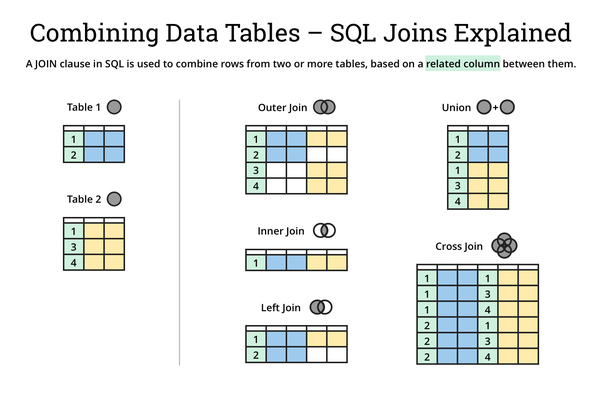

---
jupyter:
  jupytext:
    text_representation:
      extension: .md
      format_name: markdown
      format_version: '1.0'
      jupytext_version: 0.8.6
  kernelspec:
    display_name: Python 3
    language: python
    name: python3
---

# Ciencia de datos


## Pandas

Vamos a ver qué dicen los propios creadores del paquete

> **pandas** is a Python package providing fast, flexible, and expressive data structures designed to make working with “relational” or “labeled” data both easy and intuitive. It aims to be the fundamental high-level building block for doing practical, **real world** data analysis in Python. Additionally, it has the broader goal of becoming **the most powerful and flexible open source data analysis / manipulation tool available in any language.** It is already well on its way toward this goal.

Pandas funciona muy bien para hacer análisis de datos en python. Si vienen de R, pandas hace todo lo que los `data.frame` (aunque el cambio se siente pesado, sobre todo si acostumbran a usar el hadleyverse y a todo le avientan `%>%`). Si nunca han usado R, al menos espero que no hayan tenido que trabajar con estas cosas en Excel. 

La idea es trabajar con *data frames*, tablas de nuestros datos pero con más estructura que una matriz plana de numpy. Usualmente, cada columna es una variable, cada fila es una observación y cada tipo de observación es una tabla. Esto se llama tercera forma normal si le preguntas a un DBA y *tidy data* si le preguntas a un data scientist.

 > En teoría estricta, las definiciones no son equivalentes. Pueden ver más en [el paper original](https://vita.had.co.nz/papers/tidy-data.pdf) de Hadley Wickham, y este [post](https://datascience.stackexchange.com/questions/43184/equivalence-of-tidy-data-and-third-normal-form) en datascience stackexchange
 
 Igual que en scipy, voy a traerme los ejemplos de la documentación con el doble propósito de evitarme pensar en ejemplos que alguien más experimentado ya pensó y enseñarles que pueden aprender a usar muchos paquetes leyendo algún intro en la documentación como [10 minutes to pandas](http://pandas.pydata.org/pandas-docs/stable/getting_started/10min.html) :)

```python
import numpy as np
import pandas as pd
```

### Estructuras de datos


Pandas extiende los arreglos de numpy a `Series`. Una serie de pandas es básicamente un arreglo de numpy junto con sus etiquetas. Si les suena parecido a un diccionario como listas ligadas (y espero que sí) lo están pensando de una manera correcta. De hecho, pueden hacer una serie de pandas con un diccionario

```python
d = {'b':1., 'c':2, 'a':4}
pd.Series(d)
```

También pueden hacerlo desde arreglos de numpy.

```python
values = np.array([1., 2., 4.])
idx = np.array(['b', 'c', 'a'])
pd.Series(values, index=idx)
```

> ¿Qué creen que haga  `pd.Series(d, index=['a', 'b', 'b', 'c'])`?

```python
pd.Series(d, index=['a', 'b', 'b', 'c'])
```

Cuando tengan más de un arreglo asociado al mismo índice, pueden acomodarlo en un dataframe, que pueden pensar como una tabla de SQL o un diccionario de arreglos (que son transformados en series de pandas). 
Yo sólo voy a usar esa construcción, pero pandas es muy flexible. 

```python
d = {'x1': np.random.randn(10),
    'x2': np.random.randn(10),
    'y': np.random.randn(10)}

pd.DataFrame(d)
```

Noten que como no dimos un índice, usó los números $0, 1, \cdots, n$. Si tuviéramos un índice importante como fechas o llaves en tablas de SQL, podemos hacer el dataframe usando

```python
idx = np.random.randint(2283, 3933, size=10)

s2 = pd.Series(['a', 'b', 'c', 'a', 'b', 'b', 'b', 'c', 'a', 'b'], index=idx)
s1 = pd.Series(np.random.randn(10), index=idx)
sy = pd.Series(10*np.random.randn(10), index=idx)

df = pd.DataFrame({'x1':s1, 'x2':s2, 'y':sy})
df
```

Para añadir columnas a un dataframe existente, la sintaxis es

```python
df['lineal'] = 2*df['x1']+5*df['y']
df
```

```python
df['compara'] = df['y']>0
df
```

Para asignar columnas que dependen de otras como en `dplyr`, existe `.assign`.

```python
dfa = pd.DataFrame({"A": [1, 2, 3],
                    "B": [4, 5, 6]})
dfa.assign(C=lambda x: x['A'] + x['B'],
           D=lambda x: x['A'] + x['C'])
```

Ojo, usualmente los métodos de pandas regresan una copia, pero no modifican el objeto, de hecho `dfa` nunca cambió.

```python
dfa
```

Voy a cargar un dataset de `scikit-learn` (que veremos después) para complicar un poco los ejemplos.

```python
from sklearn.datasets import load_boston

boston_data = load_boston()
boston = pd.DataFrame(boston_data.data, columns=boston_data.feature_names)
boston['target'] = pd.Series(boston_data.target)
```

Los dataframes tienen algunas funciones útiles para conocerlos rápido.

```python
boston.head()
```

```python
boston.dtypes
```

De entrada esto está mal. La variable `CHAS` debería ser booleana.

```python
boston['CHAS'] = boston['CHAS'].astype(bool)
boston.head()
```

```python
boston.describe()
```

Noten que no mostró la variable booleana.


Pueden seleccionar columnas con

```python
boston[['CRIM', 'NOX', 'target']].head(2)
```

y filas con

```python
boston.loc[[0, 1, 2, 3]]
```

O con un arreglo de bools

```python
boston.loc[boston.INDUS > boston.INDUS.median()].head()
```

Los índices no necesariamente deben ser números. `.loc` usa la etiqueta del índice, y para usar el numerito está `.iloc`. Solo por ejemplificar, voy a ponerle un índice de fechas a este dataframe (aunque no signifique nada)

```python
idx = pd.date_range('20080101', freq='W', periods=boston.shape[0])
boston.index = idx
```

```python
boston.head()
```

De este ejemplo llévense que 

1. Los índices no necesariamente son números
2. `.index` puede asignarse de manera segura. De hecho, también `.columns`, los nombres.
3. Hay un atributo `.shape` 

```python
boston.columns = boston.columns.map(str.lower)
```

```python
boston.head()
```

> Otro ejemplo con mucho contenido. ¿Qué hicimos con `map`?

Y sólo para terminar de combinar ideas

```python
boston.loc['2009-01-01':'2011-01-01', ['rm', 'age', 'lstat']].head()
```

Ahora vamos a usar otro dataset de chocolate.

```python
idx = pd.date_range('20051206', periods=1000)
x1 = 10*np.random.randn(1000)
x2 = 2*np.random.randn(1000) -4
df = pd.DataFrame({'x1':x1, 'x2':x2}, index=idx)

df.describe()
```

```python
idx_malos = np.random.rand(100) > 0.85
```

> ¿Cuánto esperan que sea `idx_malos.mean()`?

```python
df.loc[idx_malos, 'x1'] = np.nan
df.describe()
```

¿Ven qué cambió? Los 10 valores `np.nan` desaparecen del count, pero son ignorados en las operaciones. Podemos quitar las filas con `nan` usando

```python
df.dropna()
```

O pueden imputar los valores

```python
df = df.fillna(df['x1'].median())
df.isnull().sum()
```

Pueden hacer cosas como

```python
df.mean()
```

```python
df.mean(axis=1)
```

O aplicar una función a cada elemento de cada columna

```python
df.apply(np.cumsum)
```

###  [JOINs](http://pandas.pydata.org/pandas-docs/stable/user_guide/merging.html)

Por supuesto que no podría existir un paquete para operar tablas sin joins estilo SQL. Existen muchos buenos recursos para aprender álgebra relacional y a pegar tablas incluyendo la [documentación](http://pandas.pydata.org/pandas-docs/stable/user_guide/merging.html) de pandas. Yo sólo voy a ponerles una imagen que saqué de [aquí](https://dataschool.com/learn/sql-join-types-explained-visualizing-sql-joins-and-building-on-the-classic-venn-diagrams) y a recomendarles que aprendan SQL porque pandas no escala.



Vamos a hacer un par de ejemplos.

```python
base = 'https://raw.githubusercontent.com/jarotter/python_ciencias_aplicadas/master/data/northwind/'
orders = pd.read_csv(base + 'orders.csv')
orders.head()
```

```python
order_details = pd.read_csv(base+'order_details.csv')
order_details.head()
```

¿Ven la estructura de las tablas? En la primera, sólo hay una entrada para cada `orderID` (verifíquenlo como ejercicio) mientras que en la segunda hay tantas como productos distintos se compraron en esa orden. Para juntar todas en una sola tabla usamos

```python
df = order_details.merge(orders, how='right', on='orderID')
df.head()
```

Y sólo para paz mental, vean que sí fue un right join:


```python
df.shape
```

```python
order_details.shape
```

```python
orders.shape
```

Usualmente, usarán

# ```
pd.merge(left, right, how='inner', on=None, left_on=None, right_on=None,
         sort=True)
# ```

donde (copiadito de la documentación)

+ `left` y `right` son dataframes.

+ `on`: Es la(s) columna(s) sobre las cuales hacer el join. Debe estar en ambos dataframes. Si no lo proporcionan, pandas lo intenta inferir automáticamente (y usa todas las que coincidan).

+ `left_on` y `right_on` : Por si se llaman diferente en cada dataframe.

+ `how` : Pueden enviar 'left', 'right', 'outer', 'inner'. D

+ `sort`: Ordena el resultado uniendo llaves en orden lexiográfico. Por defecto vale True, pero cambiarlo a False puede mejorar el desempeño.


### [Agregaciones](http://pandas.pydata.org/pandas-docs/stable/user_guide/groupby.html#)


Supongamos que con los mismos datos interesa saber cuántos productos en total vendió un cada empleado. Para ello, hay que "agrupar" las órdenes según el empleado y sumar en cada grupo.

```python
df.groupby('employeeID')
```

Bueno, eso no dice mucho. Por abajo pandas no hace ninguna división hasta que se necesite, y pueen mandar un arreglo en vez de una sola columna. Siguiente paso:

```python
df.groupby('employeeID').size()
```

```python
df.groupby('employeeID').agg({'quantity':sum, 'orderID':'size'})
```

También pueden aplicar la función sin reducir el dataframe. Este concepto se llama `transform` en pandas. Vamos a mostrar solo un ejemplo pequeño. Supongamos que para cada orden se quiere saber qué porcentaje del costo ocupó cada producto

Una solución es

```python
order_details['precio_sku'] = order_details['quantity'] * \
    order_details['unitPrice']*(1-order_details['discount'])

order_details['precio_relativo'] = order_details['precio_sku'] / \
    order_details.groupby('orderID')['precio_sku'].transform(sum)

order_details
```

`transform` es un poco más difícil de entender en abstracto, pero en la práctica es muy útil. [Aquí](https://pbpython.com/pandas_transform.html) un recurso que lo explica.


### [Forma de los dataframes](https://nikgrozev.com/2015/07/01/reshaping-in-pandas-pivot-pivot-table-stack-and-unstack-explained-with-pictures/)

Otra cosa muy común es transformar cuál es la unidad observacional de sus tablas. Es decir, pueden querer cambiar el índice de una cosa a otra y el significado de las columnas. Por ejemplo, supongamos que este dataframe representa productos que se quieren vender, y cuánto cuestan según su tipo de cliente.

```python
df
```

```python
table = dict((
    ("producto", ['p0', 'p0', 'p1', 'p1']),
    ('tipo_cliente',['oro', 'bronce', 'oro', 'plata']),
    ('USD',  [1., 2., 3., 4.]),
    ('EU',   [0.85, 1.8, 2.5, 3])
))
df = pd.DataFrame(table)
```

```python
df
```

Para ver cómo varía el precio en dólares según el tipo de cliente, una tabla más adecuada es

```python
df.pivot(index='producto', columns='tipo_cliente', values='USD')
```

Y para ver cómo varían ambos

```python
df.pivot(index='producto', columns='tipo_cliente')
```

Noten que ahora las columnas tienen un índice múltiple

```python
df.pivot(index='producto', columns='tipo_cliente').columns
```

`pivot` necesita que la combinación (index, columns) sean únicos. Si no, arroja una excepción.

```python
table = dict((
    ("producto", ['p0', 'p0', 'p0', 'p1']),
    ('tipo_cliente',['oro', 'bronce', 'oro', 'plata']),
    ('USD',  [1., 2., 3., 4.]),
    ('EU',   [0.85, 1.8, 2.5, 3])
))
df = pd.DataFrame(table)
df
```

```python
df.pivot(index='producto', columns='tipo_cliente', values='USD')
```

Para que pandas pueda hacerlo y agregue si es necesario, se usa la función `pivot_table` y su argumento `aggfunc`

```python
df.pivot_table(index='producto', columns='tipo_cliente', values='USD', aggfunc=np.mean)
```

La operación *contraria* (por decirle de alguna forma) es `melt`. Imaginen que ahora tienen una tabla en forma larga. De la documentación

> This function (`melt`) is useful to massage a DataFrame into a format where one
or more columns are identifier variables (`id_vars`), while all other
columns, considered measured variables (`value_vars`), are "unpivoted" to
the row axis, leaving just two non-identifier columns, 'variable' and
'value'.

```python
df = pd.DataFrame(data = {
    'Day' : ['MON', 'TUE', 'WED', 'THU', 'FRI'], 
    'Google' : [1129,1132,1134,1152,1152], 
    'Apple' : [191,192,190,190,188] 
})
df
```

```python
df.melt(id_vars=['Day'], var_name='Company', value_name='Closing Price')
```

¿Cómo regresarían esto a la forma original?


## Seaborn

Aunque pandas tiene sus métodos para hacer gráficas, `seaborn` es un paquete dedicado mucho más completo, y vale la pena estudiarlo de una vez. Vamos a usar ejemplos incluídos en seaborn.

```python
import matplotlib.pyplot as plt
import seaborn as sns
sns.set()
```

Queremos usar estos datos para predecir la propina. Antes de aventarle un algoritmo de aprendizaje de máquina, siempre hay que estudiar las relaciones que los datos tienen.

```python
tips = sns.load_dataset('tips')
tips.head()
```

```python
tips.describe()
```

Visualicemos la distribución de la respuesta.

```python
sns.set()
sns.distplot(tips.tip)
```

También podemos hacer un histograma

```python
sns.distplot(tips.tip, kde=False, rug=True)
```

Pueden usar seaborn directamente para ajustar un modelo paramétrico también.

```python
from scipy import stats
sns.distplot(tips.tip, kde=False, fit=stats.invgauss)
```

Busquemos ahora correlación entre `tip` y `total_bill`.

```python
sns.jointplot(x='total_bill', y='tip', data=tips)
```

O si el dataset tuviera más variables continuas (como Iris) podríamos hacer todos los pares de golpe.

```python
iris = sns.load_dataset('iris')
sns.pairplot(iris)
```

Volviendo a nuestros datos originales, también podemos ver la distribución de la respuesta condicionar en una variable categórica como sexo.

```python
sns.catplot(x='sex', y='tip', data=tips, kind='box')
```

¿Será diferente si nos fijamos en el porcentje de propina?

```python
(
    tips.
    assign(porcentaje_propina=100*tips['tip']/tips['total_bill'])
    .pipe((sns.catplot, 'data'),
        x='sex', y='porcentaje_propina', kind='box')
)
```

Dos *takeaways* en ese ejemplo:
1. `pandas` tiene  un método `pipe` por si de plano no quieres dejar el hadleyverse :)
2. Piensen con cuidado sus variables de respuesta cuando hagan un modelo.


Para ver más variables al mismo tiempo

```python
sns.scatterplot(x='total_bill', y='tip', hue='smoker', size='size', sizes=(100,650), data=tips)
```

```python
sns.scatterplot(x='total_bill', y='tip', hue='size', style='smoker', s=150, data=tips)
```

¿Cuál les parece más claro?


También hay funciones muy útiles para series de tiempo

```python
fmri = sns.load_dataset("fmri")
fmri.head()
```

Son series de tiempo para distintos sujetos.

```python
sns.relplot(x="timepoint", y="signal", kind="line", data=fmri)
```

Los intervalos de confianza se calculan con [bootstrap](https://en.wikipedia.org/wiki/Bootstrapping_(statistics)).

¿Qué no está siendo transparente?

```python
sns.relplot(x="timepoint", y="signal", kind="line", estimator=np.median, data=fmri)
sns.relplot(x="timepoint", y="signal", kind="line", estimator=np.mean, data=fmri)
```

```python
fmri.region.describe()
```

```python
fmri.event.describe()
```

Podemos separar por una de esas categóricas.

```python
sns.relplot(x="timepoint", y="signal", hue="event", kind="line", data=fmri)
```

O por ambas.

```python
sns.relplot(x="timepoint", y="signal", hue="region", style='event', kind="line", data=fmri)
```

O por sujeto completamente.

```python
sns.relplot(x="timepoint", y="signal", hue="region",
            units="subject", estimator=None,
            kind="line", data=fmri.query("event == 'stim'"))
```

## Vista rápida a otros paquetes:

### [`scipy.stats`](https://docs.scipy.org/doc/scipy/reference/tutorial/stats.html).

Ya habíamos visto algunas partes de SciPy, y también hay toda una colección de funciones estadísticas. Dentro de `scipy.stats` hay funciones para generar números aleatorios de al menos 90 modelos diferentes, con la posibilidad de definir nuevas variables aleatorias a través de su función de distribución. 

```python
from scipy import stats
```

Por ejemplo, para generar observaciones de una normal estándar

```python
stats.norm.rvs(size=10)
```

Las distribuciones en SciPy están parametrizadas por scale/location. Esto puede ser un poco raro porque en ocasiones es diferente a los parámetros naturales de las distribuciones, pero nada que ver la documentación no resuelva. 

Para especificar por ejemplo, la media y desviación estándar de una normal usamos `loc` y `scale`.

```python
sns.distplot(stats.norm.rvs(loc=3, scale=1/4.85, size=100))
```

Las distribuciones, además de `rvs` (random variates) tienen métodos

+ pdf: función de densidad de probabilidad
+ cdf: función de distribución 
+ sf: función de supervivencia (1-CDF)
+ ppf: función cuantil (inversa de la CDF)
+ isf: función de supervivencia inversa

Para asegurar reproducibilidad, el argumento es `random_state`

```python
stats.gamma.rvs(a=2, size=100, random_state=2283)
```

Para ajustar un modelo a datos, se puede usar el método `fit`, que por defecto da los estimadores máximoverosímiles.

```python
x = stats.norm.rvs(loc=14, scale=2, size=35)
stats.norm.fit(x)
```

En este paquete también hay diferentes medidas de correlación (por supuesto la de Pearson, la de Spearman y la tau de Kendall), funciones para hacer pruebas de hipótesis (incluyendo Kolmogorov-Smirnov, Anderson-Darling, Wilcoxon y otras), transformaciones como Box-Cox, un método para muestrear de una distribución arbitraria y funciones circulares.

Para más información, vean la [referencia](https://docs.scipy.org/doc/scipy/reference/stats.html) o el [tutorial](https://docs.scipy.org/doc/scipy/reference/tutorial/stats.html).

### Más estadística: [statsmodels](http://www.statsmodels.org/stable/index.html)

Si necesitan algo un poco más sofisticado como series de tiempo, modelos mixtos (la versión frecuentista de los modelos jerárquicos), ANOVA, modelos lineales y lineales generalizados, análisis de supervivencia o tablas de contingencia, statsmodels es el paquete correcto. Los objetos de `statsmodels` están pensados para parecerse más a R. Pueden usar notación de fórmula y el output a consola es mucho más amigable

```python
import statsmodels.api as sm
import statsmodels.formula.api as smf

# Datos
df = sm.datasets.get_rdataset("Guerry", "HistData").data

# Regresión
r = smf.ols('Lottery ~ Literacy + np.log(Pop1831)', data=df).fit()


print(r.summary())
```

### Estadística bayesiana

La oferta de software para cómputo bayesiano está creciendo mucho en Python.

#### [PyMC3](https://docs.pymc.io)
Es proyecto de NumFocus. Tiene [tutoriales](https://docs.pymc.io/nb_tutorials/index.html) y [ejemplos](https://docs.pymc.io/nb_examples/index.html) buenísimos para aprender análisis de datos bayesiano. Aunque el backend está construido sobre una plataforma descontinuada (theano) el equipo de desarrollo ya está trabajando en PyMC4 sobre TensorFlow :)

PyMC3 tiene una buena implementación de NUTS (un algoritmo de hamiltonian monte carlo) y algunos métodos variacionales modernos. Es una opción sólida en general.

#### Pyro
Desarrollado sobre PyTorch por los ingenieros de Uber, [Pyro](http://pyro.ai) se enfoca más en métodos variacionales para escalar a grandes volúmenes. Muy bueno para control estocástico o deep learning bayesiano.

#### Edward
[Edward](http://edwardlib.org) fue desarrollado por Dustin Tran con apoyo de David Blei (rockstars del cómputo bayesiano) y está sobre TensorFlow. No lo he usado mucho pero TensorFlow es una base muy sólida porque lo mantiene Google y el paquete tiene todo el enfoque moderno de análisis bayesiano.


### Aprendizaje de máquina

#### scikit-learn
scikit-learn es el paquete por excelencia de aprendizaje de máquina en Python. Tiene ya once años de maduración y sobre él se han construido varias extensiones. SKLearn permite preprocesar datos y ajustar modelos de aprendizaje de máquina de manera muy rápida.

La idea del API de sklearn es que cada **predictor** (un algoritmo de aprendizaje) tiene métodos de `.fit` y `.predict`, además de `.transform` si tiene sentido. Esto puede ser raro de usar al inicio, pero cuando te acostumbras a la convención resulta muy cómoda la consistencia.

Scikit-learn tiene implementación de varios algoritmos de regresión, clasificación, *clustering*, reducción de dimensión e imputación de datos faltantes. Además, permite construir pipelines completos que incluyan división en conjunto de prueba y entrenamiento, validación cruzada y optimización de hiperparámetros (hay una versión bayesiana en el paquete scikit-optimize).

#### TensorFlow y Keras
Está mucho más allá del alcance de este curso, pero son los paquetes para hacer deep learning. Keras realmente es un API de alto nivel sobre TensorFlow.


### Bokeh

Si quieren visualización un poco más fresa, [bokeh](https://bokeh.pydata.org/en/latest/docs/gallery.html) es mucho más interactivo que lo que pueden hacer en seaborn. 

De cualquier modo, si quieren visualizaciones *muuuy* finas, tal vez valga la pena aprender D3.
